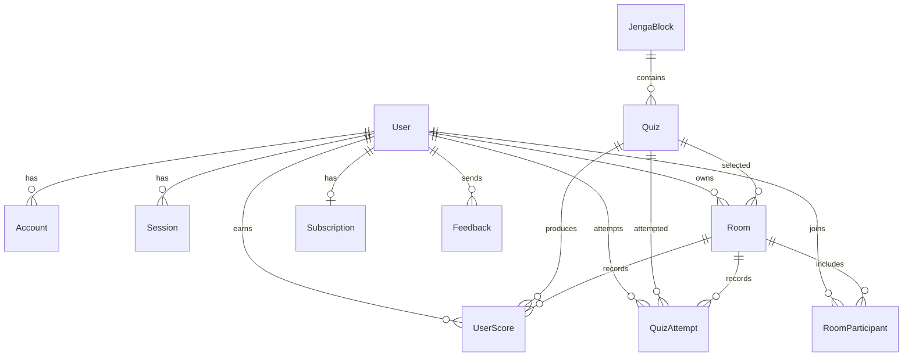
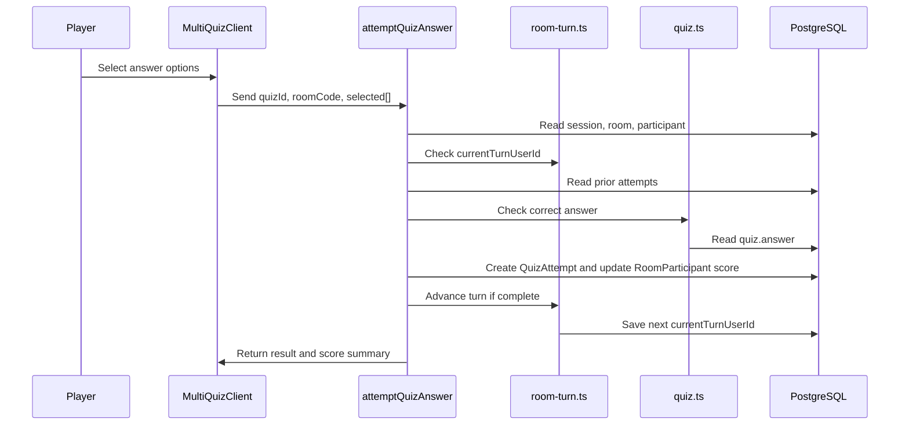

# Jenga Architect Technical Document

**Project:** Jenga Architect  
**Document version:** 1.0  
**Prepared for:** Product demonstration, portfolio review, and technical explanation  
**Progress checklist:** 7/7 required sections completed

---

## Table of Contents

| Section | Topic | Page |
| --- | --- | --- |
| 1 | Introduction / Plan | p. 1 |
| 2 | Design | p. 4 |
| 3 | Implementation | p. 11 |
| 4 | User Guidance | p. 20 |
| 5 | Conclusions | p. 25 |
| 6 | References | p. 27 |
| Appendix A | Source Code Map | p. 29 |
| Appendix B | Image and Asset Map | p. 31 |

> Note: Page numbers are logical report page markers for document organization. If this Markdown file is exported to PDF, final physical page numbers may shift depending on font size and renderer.

---

## 1. Introduction / Plan

### 1.1 Product Summary

Jenga Architect is a web-based learning game for Python object-oriented programming. It combines physical Jenga blocks, QR codes, solo quizzes, multiplayer rooms, turn-based scoring, authentication, subscriptions, profile management, and feedback tools.

The core idea is simple: learners pull or scan a Jenga block, answer an OOP quiz, and receive score feedback. In multiplayer mode, the app controls the room, player turns, attempts, scoring, and elimination when the tower is broken.

### 1.2 Objectives

The project objectives are:

| Objective | Explanation |
| --- | --- |
| Make OOP learning more active | Convert abstract Python OOP topics into short game-based quiz challenges. |
| Support solo and group learning | Provide both individual practice and multiplayer competition. |
| Connect physical and digital play | Use QR codes on Jenga blocks to open matching quiz flows. |
| Keep rules server-side | Validate turns, attempts, scores, and permissions on the server. |
| Support real product features | Include authentication, profile images, subscriptions, admin feedback, and deployment-ready configuration. |

### 1.3 Scope

The current scope includes:

- Home screen with solo and multiplayer choices.
- Solo quiz mode by difficulty level.
- Multiplayer room creation, joining, lobby, board, QR scanning, quiz answering, and game-over flow.
- Authentication with Google, GitHub, and admin/demo credentials when configured.
- Role and subscription control for premium levels.
- PostgreSQL data model through Prisma.
- Profile image upload through Vercel Blob.
- Feedback submission and admin feedback management.
- Stripe subscription APIs and webhook endpoint.
- QR image generation and public QR assets for 54 Jenga blocks.

Out of scope for the current version:

- Full teacher analytics dashboard.
- Real-time WebSocket synchronization.
- Full automated test suite.
- In-app quiz explanation after each wrong answer.
- Advanced anti-cheat and rate limiting.

### 1.4 Specifications

| Area | Specification |
| --- | --- |
| Framework | Next.js 16 App Router |
| Language | TypeScript |
| UI | React 19 and Tailwind CSS |
| Database | PostgreSQL |
| ORM | Prisma 7 |
| Authentication | NextAuth v4 with Prisma Adapter |
| Payments | Stripe subscription API routes |
| File storage | Vercel Blob |
| 3D rendering | React Three Fiber / Three.js |
| QR scanning | html5-qrcode |
| Data preparation | Python scripts and CSV files |

### 1.5 Main Functions

| Function | Main Files |
| --- | --- |
| Authentication | `src/lib/auth.ts`, `src/app/api/auth/[...nextauth]/route.ts`, `src/app/api/auth/signin/page.tsx`, `src/app/secretUser/*` |
| Admin route protection | `src/proxy.ts` |
| Home menu | `src/app/page.tsx`, `src/components/HomeMenu.tsx` |
| Solo quiz | `src/app/play/solo/page.tsx`, `src/app/play/solo/[level]/page.tsx`, `src/components/QuizContainer.tsx`, `src/components/QuizEngine.tsx` |
| Multiplayer room creation/join | `src/components/MultiplaySelector.tsx`, `src/app/api/rooms/create/route.ts`, `src/app/api/rooms/join/route.ts` |
| Multiplayer lobby | `src/app/play/multi/[roomCode]/page.tsx`, `src/components/RoomLobbyClient.tsx`, `src/components/ui/StartGameButton.tsx` |
| Multiplayer board | `src/app/play/multi/[roomCode]/board/page.tsx`, `src/components/RoomBoardClient.tsx`, `src/hooks/useRoomPolling.ts` |
| Multiplayer quiz/scoring | `src/app/play/multi/[roomCode]/quiz/[blockId]/page.tsx`, `src/components/MultiQuizClient.tsx`, `src/actions/score.ts` |
| Turn and ranking logic | `src/lib/room-turn.ts`, `src/lib/multiplayer-scoring.ts` |
| QR scanning | `src/components/QrScannerModal.tsx`, `public/qrs/*` |
| Profile settings | `src/components/menu/profile/*`, `src/actions/profile.ts`, `src/actions/upload.ts` |
| Feedback | `src/components/menu/feedback/*`, `src/actions/feedback.ts`, `src/app/feedback/page.tsx` |
| Subscription | `src/app/subscription/*`, `src/app/api/stripe/*`, `src/lib/subscription.ts`, `src/lib/stripe.ts` |

---

## 2. Design

### 2.1 System Architecture

```mermaid
flowchart TD
    User[User / Player] --> Browser[Browser]
    Browser --> Next[Next.js App Router]

    Next --> Client[Client Components]
    Next --> Server[Server Components]
    Client --> Actions[Server Actions]
    Client --> APIs[API Routes]

    Server --> Prisma[Prisma Client]
    Actions --> Prisma
    APIs --> Prisma
    Prisma --> DB[(PostgreSQL)]

    Next --> Auth[NextAuth]
    Auth --> DB

    APIs --> Stripe[Stripe]
    Stripe --> Webhook[/api/stripe/webhook]
    Webhook --> Prisma

    Actions --> Blob[Vercel Blob]
    QR[Physical Jenga QR Codes] --> Browser
```

### 2.2 Architecture Explanation

The app uses Next.js App Router. Server Components fetch protected data before rendering pages, while Client Components handle interactive UI such as selecting answers, opening modals, scanning QR codes, and navigating between screens.

Server Actions are used for user-triggered mutations such as quiz answers, feedback, uploads, and profile changes. API Routes handle room operations and external-service callbacks, especially Stripe subscription events.

Prisma centralizes database access and maps TypeScript code to PostgreSQL models. NextAuth manages OAuth and session state. Vercel Blob stores user-uploaded profile images. Public QR images connect the physical Jenga blocks to digital quiz routes.

### 2.3 ERD



### 2.4 Data Dictionary

#### User

| Field | Type | Description |
| --- | --- | --- |
| `id` | String | Unique user ID. |
| `name` | String? | Display name. |
| `email` | String | Unique email for authentication. |
| `image` | String? | Profile image URL. |
| `role` | Role | `NORMAL` or `ADMIN`. |
| `stripeCustomerId` | String? | Stripe customer ID. |
| `isPro` | Boolean | Whether the user has Pro access. |
| `createdAt` / `updatedAt` | DateTime | Audit timestamps. |

#### JengaBlock

| Field | Type | Description |
| --- | --- | --- |
| `id` | String | Logical block ID, such as `BLOCK-01`. |
| `physicalId` | Int | Unique physical block number. |
| `category` | String | Learning category. |
| `questions` | Quiz[] | Quizzes connected to the block. |

#### Quiz

| Field | Type | Description |
| --- | --- | --- |
| `id` | String | Unique quiz ID. |
| `question` | String | Question text. |
| `options` | String[] | Answer choices. |
| `answer` | Int[] | Correct answer indexes. Kept server-side. |
| `isPremium` | Boolean | Whether quiz belongs to paid level. |
| `level` | Level | `ENTRY`, `JUNIOR`, or `SENIOR`. |
| `blockId` | String | Related Jenga block. |
| `subIndex` | Int | Question order for the same block. |

#### Room

| Field | Type | Description |
| --- | --- | --- |
| `id` | String | Unique room ID. |
| `joinCode` | String | 8-character room code. |
| `status` | RoomStatus | `WAITING`, `PLAYING`, or `FINISHED`. |
| `level` | Level | Room difficulty. |
| `maxPlayers` | Int | Maximum participant count. |
| `ownerId` | String | Host user ID. |
| `currentTurnUserId` | String? | User whose turn is active. |

#### RoomParticipant

| Field | Type | Description |
| --- | --- | --- |
| `id` | String | Unique participant ID. |
| `roomId` | String | Related room. |
| `userId` | String | Related user. |
| `joinedAt` | DateTime | Join time used for turn ordering. |
| `totalScore` | Int | Multiplayer total score. |
| `isEliminated` | Boolean | Whether the player broke the tower. |
| `eliminatedAt` | DateTime? | Elimination timestamp. |

#### QuizAttempt

| Field | Type | Description |
| --- | --- | --- |
| `id` | String | Unique attempt ID. |
| `roomId` | String | Room where attempt happened. |
| `userId` | String | Player who answered. |
| `quizId` | String | Quiz answered. |
| `attemptNumber` | Int | Attempt order for the quiz. |
| `isCorrect` | Boolean | Result. |
| `pointsChange` | Int | Score delta. |

#### UserScore

| Field | Type | Description |
| --- | --- | --- |
| `id` | String | Unique score ID. |
| `score` | Int | Score value. |
| `quizId` | String | Related quiz. |
| `userId` | String | Related user. |
| `roomId` | String? | Related room for multiplayer. |
| `mode` | GameMode | `SOLO` or `MULTIPLAYER`. |

#### Subscription and Feedback

| Model | Purpose |
| --- | --- |
| `Subscription` | Stores Stripe subscription status, price ID, and period end. |
| `Feedback` | Stores user feedback, type, read state, and author. |

### 2.5 Storyboard

| Step | Screen / Event | User Action | System Response |
| --- | --- | --- | --- |
| 1 | Sign-in | User chooses Google, GitHub, or Admin / Demo login. | NextAuth creates or loads a user session. |
| 2 | Home | User chooses Solo or Multi. | App opens solo level grid or multiplayer modal. |
| 3 | Solo setup | User selects level and question count. | App loads a shuffled quiz set for that level. |
| 4 | Solo quiz | User arranges options and submits. | Server verifies answer and client shows result. |
| 5 | Multiplayer setup | Host chooses Entry / Junior / Senior. | API creates a room and join code. |
| 6 | Lobby | Players join using code. | Participants are stored in `RoomParticipant`. |
| 7 | Start game | Host starts. | Server changes room to `PLAYING` and initializes first turn. |
| 8 | Board | Current player scans or selects a block. | App routes to block quiz page. |
| 9 | Multiplayer quiz | Player submits answer. | Server validates turn, answer, attempts, and score. |
| 10 | Turn advance | Correct answer or max attempts reached. | `advanceTurn` selects the next active player. |
| 11 | Break tower | Current player declares tower break. | Player is eliminated and game state updates. |
| 12 | Game over | Game finishes. | Standings are shown in the game-over modal. |

### 2.6 Main Multiplayer Flow



---

## 3. Implementation

### 3.1 Application Structure

| Directory | Responsibility |
| --- | --- |
| `src/app` | App Router pages, layouts, loading UI, and API routes. |
| `src/components` | Reusable UI, game, quiz, room, menu, and scanner components. |
| `src/actions` | Server Actions for quiz, score, upload, profile, and feedback mutations. |
| `src/lib` | Shared business logic for auth, Prisma, validation, levels, scoring, turns, Stripe, and subscriptions. |
| `src/hooks` | Client hooks such as room polling. |
| `src/types` | Shared application types. |
| `prisma` | Schema, CSV data, and data preparation scripts. |
| `public` | Images, icons, default photo, solo/multiplayer images, and QR codes. |

### 3.2 Authentication and Authorization

`src/lib/auth.ts` configures NextAuth with Google, GitHub, and optional Admin / Demo credentials. The Prisma Adapter connects authentication data to the database.

Important implementation points:

- `session.strategy` is set to JWT.
- The JWT callback stores `id`, `role`, and `isPro`.
- Client-triggered session updates may update display fields, but not privileged fields.
- `role` and `isPro` are refreshed from the database, reducing the risk of client-side self-elevation.
- `src/proxy.ts` protects `/feedback` and `/usersCheck` so only admins can access those pages.

### 3.3 Room Creation and Joining

`src/app/api/rooms/create/route.ts` creates multiplayer rooms.

Main behavior:

1. Checks that the user is authenticated.
2. Parses the requested level with `parseLevel`.
3. Checks Pro/Admin access through `canAccessLevel`.
4. Generates a unique 8-character join code using `randomBytes`.
5. Creates the `Room`.
6. Adds the host as a `RoomParticipant`.

`src/app/api/rooms/join/route.ts` allows players to join.

Main behavior:

1. Requires authentication.
2. Finds the room by uppercase join code.
3. Rejects missing rooms and rooms not in `WAITING`.
4. Rejects rooms older than one hour.
5. Uses `upsert` so joining twice does not duplicate a participant.

### 3.4 Multiplayer Board

`src/components/RoomBoardClient.tsx` is the main active-game screen.

It displays:

- Join code.
- Difficulty level.
- Current turn status.
- Player score bar.
- 3D Jenga tower.
- QR scan button.
- Break tower button.
- Game-over modal.

The board uses `useRoomPolling` to refresh room state every 2.5 seconds. This keeps each player updated without WebSockets.

### 3.5 Quiz Answering and Scoring

`src/actions/score.ts` is the most important game-rule file.

`attemptQuizAnswer` performs:

1. Session validation.
2. Answer format validation.
3. Room lookup and status check.
4. Participant lookup.
5. Elimination check.
6. Turn ownership check through `isPlayerTurn`.
7. Prior attempt lookup.
8. Maximum-attempt protection.
9. Server-side answer validation through `checkQuizAnswer`.
10. Score calculation.
11. Prisma transaction to create `QuizAttempt` and update `RoomParticipant.totalScore`.
12. Turn advancement when the player is correct or out of attempts.

This design prevents a player from scoring outside their turn or from submitting unlimited attempts.

### 3.6 Turn Management

`src/lib/room-turn.ts` handles turn order.

| Function | Purpose |
| --- | --- |
| `getActiveParticipantsOrdered` | Loads non-eliminated players ordered by `joinedAt`. |
| `initializeTurn` | Sets the first active player as current turn. |
| `advanceTurn` | Finds the next active player and saves it to `Room.currentTurnUserId`. |
| `isPlayerTurn` | Confirms whether a user is the current turn player. |
| `assertPlayerTurn` | Throws an error when a user is not the current turn player. |

### 3.7 Scoring and Standings

`src/lib/multiplayer-scoring.ts` defines game constants:

| Constant | Value |
| --- | --- |
| Entry correct answer | +200 |
| Junior correct answer | +300 |
| Senior correct answer | +400 |
| Wrong answer penalty | -50 |
| Maximum attempts | 3 |

`computeStandings` sorts active players by score and places eliminated players at the losing rank. This logic is used by room APIs and game-over UI.

### 3.8 Solo Quiz System

Solo mode uses:

- `src/app/play/solo/page.tsx` for level selection.
- `src/app/play/solo/[level]/page.tsx` for quiz loading.
- `src/components/QuizContainer.tsx` to manage quiz sequence.
- `src/components/QuizEngine.tsx` for quiz interaction.
- `src/actions/quiz.ts` and `src/lib/quiz.ts` for server-side answer checking.

The solo quiz page shuffles available quizzes and limits the number using `MAX_SOLO_QUIZ_LIMIT`.

### 3.9 QR Code Flow

QR assets are stored in `public/qrs`, using names such as `BLOCK-01.png` through `BLOCK-54.png`. The scanner modal uses `html5-qrcode` to read a block ID and route the player to a matching quiz page.

QR flow:

1. Player opens scanner.
2. Browser camera scans QR code.
3. QR text resolves to a block ID.
4. App navigates to `/play/multi/[roomCode]/quiz/[blockId]`.
5. Server loads quiz by `blockId`, room level, and sub-index.

### 3.10 Profile, Upload, and Feedback

`src/actions/upload.ts` uploads profile images to Vercel Blob. It checks:

- User authentication.
- File existence.
- Allowed MIME type.
- Maximum size of 5 MB.

`src/lib/validation.ts` centralizes upload and feedback limits.

`src/actions/feedback.ts` allows logged-in users to submit feedback and admins to mark feedback as read.

### 3.11 Subscription and Pro Access

Subscription-related code is located in:

- `src/app/subscription/SubscriptionPanel.tsx`
- `src/app/api/stripe/subscription/route.ts`
- `src/app/api/stripe/cancel-subscription/route.ts`
- `src/app/api/stripe/webhook/route.ts`
- `src/lib/subscription.ts`
- `src/lib/stripe.ts`

Pro access is checked before hosting Junior and Senior rooms. This means the UI can show locked states, but the server still enforces the access rule.

### 3.12 Security Highlights

| Security Point | Implementation |
| --- | --- |
| Admin-only routes | `src/proxy.ts` checks JWT token and role. |
| Privilege refresh | `src/lib/auth.ts` reloads `role` and `isPro` from DB. |
| Server-side answer checking | `src/lib/quiz.ts` returns correctness without exposing answers to the browser. |
| Turn validation | `src/actions/score.ts` checks `isPlayerTurn` before scoring. |
| Transactional scoring | Attempt creation and score update happen in a Prisma transaction. |
| Upload validation | MIME type and size checks prevent unexpected file uploads. |
| Premium access enforcement | Room creation API checks Pro/Admin access on the server. |

---

## 4. User Guidance

### 4.1 Home Screen

Users start from the home screen and choose either Solo or Multi.

Expected UI:

- Large title: "Learn Python Jenga Architect"
- Solo button
- Multi button
- Hamburger menu for settings, subscription, profile, feedback, and admin options

### 4.2 Solo Mode

The solo mode image asset is stored at:


Description:

Solo mode is for individual practice. The user selects a difficulty and question count, then answers a sequence of quizzes. It is best for self-study and repeated practice.

### 4.3 Multiplayer Mode

The multiplayer image asset is stored at:


Description:

Multiplayer mode lets a host create a room and other users join with an 8-character code. The host chooses Entry, Junior, or Senior. Junior and Senior require Pro/Admin access.

### 4.4 Sign-in and Demo Login

The sign-in page supports:

- Google login using `public/google.png`.
- GitHub login using `public/github.png`.
- Admin / Demo login through `/secretUser` when `DEMO_PASSWORD` is configured.

Google image:


GitHub image:


### 4.5 Room Lobby

After creating or joining a room, users enter the lobby. The lobby displays:

- Join code.
- Player list.
- Host controls.
- Start button.

The host starts the game. The server changes the room to `PLAYING` and initializes the first turn.

### 4.6 Game Board

The game board displays:

- Current room code.
- Difficulty label.
- Current turn status.
- Player score bar.
- Jenga tower.
- Scan QR button.
- Break Tower button.

Only the current player can scan a block or declare a tower break.

### 4.7 QR Code Usage

Example QR asset:


Description:

Each QR code represents one physical Jenga block. When the current player scans the code, the app routes to a quiz for that block and room level.

### 4.8 Quiz Screen

The quiz screen shows:

- Reward and penalty values.
- Attempt count.
- Question text.
- Answer construction area.
- Shuffled option buttons.
- Solve button.
- Feedback after submission.

In multiplayer mode, the player has a maximum of three attempts. Correct answers increase score. Wrong answers decrease score. Correct answer or attempt exhaustion advances the turn.

### 4.9 Profile and Default Image

Default profile image:


Users can update profile name and photo. Uploaded images are checked by MIME type and size before storage.

### 4.10 Admin and Feedback

Admins can access protected feedback and user-check pages. Normal users are redirected away by `src/proxy.ts`.

Users can submit feedback by type:

- Typo
- Bug
- Suggestion
- Quiz
- Other

### 4.11 Loading States

The app includes both button-level and route-level loading indicators:

- Login buttons show `SIGNING IN...`.
- Admin / Demo navigation shows `LOADING...`.
- Multiplayer join button shows `JOINING...`.
- Multiplayer quiz button shows `CHECKING...`.
- Route transitions use `src/app/loading.tsx`.

---

## 5. Conclusions

### 5.1 Summary

Jenga Architect is a full-stack learning application that turns Python OOP practice into an interactive physical and digital game. It includes modern web application features such as authentication, database relations, protected admin pages, subscriptions, file upload, QR scanning, and 3D visual UI.

The strongest part of the system is the multiplayer rule enforcement. The client displays the interface, but the server decides whether the user is authenticated, belongs to the room, is still active, owns the current turn, has remaining attempts, and should receive points.

### 5.2 Strengths

- Clear split between UI and server-side game rules.
- Strong relational data model for rooms, participants, attempts, and scores.
- Physical QR-based interaction makes the learning experience memorable.
- Pro/Admin access rules are checked on the server.
- The app is structured like a real deployable product, not only a quiz prototype.

### 5.3 Current Limitations

- Room updates use polling instead of real-time sockets.
- Automated tests are not yet fully implemented.
- Quiz feedback does not yet include detailed explanations.
- Teacher analytics are not yet available.
- QR-based physical play requires prepared blocks and printed assets.

### 5.4 Future Work

Recommended improvements:

1. Add E2E tests for the complete multiplayer room flow.
2. Add unit tests for turn management, scoring, and answer validation.
3. Add answer explanations for wrong attempts.
4. Replace polling with WebSocket or hosted realtime infrastructure.
5. Add teacher dashboard with level, category, and wrong-answer analytics.
6. Add rate limiting and stronger anti-cheat checks.
7. Add richer OOP question types such as code tracing and short code entry.
8. Improve accessibility for keyboard and screen-reader users.

---

## 6. References

Auth.js. (n.d.). *NextAuth.js options*. Retrieved June 5, 2026, from https://next-auth.js.org/configuration/options

Mebjas. (n.d.). *html5-qrcode: A cross-platform HTML5 QR code reader*. GitHub. Retrieved June 5, 2026, from https://github.com/mebjas/html5-qrcode

Next.js. (n.d.). *App Router*. Retrieved June 5, 2026, from https://en.nextjs.im/docs/app

Pmndrs. (n.d.). *React Three Fiber introduction*. Retrieved June 5, 2026, from https://r3f.docs.pmnd.rs/getting-started/introduction

Prisma. (n.d.). *Relations*. Retrieved June 5, 2026, from https://www.prisma.io/docs/orm/prisma-schema/data-model/relations

Stripe. (n.d.). *Use a prebuilt Stripe-hosted payment page*. Retrieved June 5, 2026, from https://docs.stripe.com/payments/checkout

Vercel. (n.d.). *Vercel Blob*. Retrieved June 5, 2026, from https://vercel.com/docs/vercel-blob

---

## Appendix A. Source Code Map

| Path | Contents |
| --- | --- |
| `src/app/layout.tsx` | Root layout, global fonts, and providers. |
| `src/app/page.tsx` | Home page entry. |
| `src/app/loading.tsx` | Global loading screen. |
| `src/proxy.ts` | Admin route protection. |
| `src/app/api/auth/[...nextauth]/route.ts` | NextAuth route handler. |
| `src/app/api/auth/signin/page.tsx` | Custom sign-in page. |
| `src/app/secretUser/page.tsx` | Admin / Demo login page gate. |
| `src/app/secretUser/SecretLoginForm.tsx` | Credentials login form. |
| `src/app/play/solo/page.tsx` | Solo mode setup page. |
| `src/app/play/solo/[level]/page.tsx` | Solo quiz loader by level. |
| `src/app/play/multi/page.tsx` | Multiplayer portal. |
| `src/app/play/multi/[roomCode]/page.tsx` | Room lobby page. |
| `src/app/play/multi/[roomCode]/board/page.tsx` | Multiplayer board page. |
| `src/app/play/multi/[roomCode]/quiz/[blockId]/page.tsx` | Multiplayer quiz page. |
| `src/app/play/multi/scan/[blockId]/page.tsx` | QR scan route for multiplayer. |
| `src/app/multi/scan/[blockId]/page.tsx` | Additional scan route. |
| `src/app/print-qr/page.tsx` | QR print page. |
| `src/app/subscription/page.tsx` | Subscription page. |
| `src/app/feedback/page.tsx` | Admin feedback page. |
| `src/app/usersCheck/page.tsx` | Admin user-check page. |
| `src/app/api/rooms/create/route.ts` | Create room API. |
| `src/app/api/rooms/join/route.ts` | Join room API. |
| `src/app/api/rooms/[roomCode]/route.ts` | Room data API. |
| `src/app/api/rooms/[roomCode]/start/route.ts` | Start room API. |
| `src/app/api/rooms/[roomCode]/leave/route.ts` | Leave room API. |
| `src/app/api/rooms/[roomCode]/close/route.ts` | Close room API. |
| `src/app/api/rooms/[roomCode]/break-tower/route.ts` | Break tower API. |
| `src/app/api/quizzes/route.ts` | Quiz API. |
| `src/app/api/stripe/subscription/route.ts` | Subscription creation/check route. |
| `src/app/api/stripe/cancel-subscription/route.ts` | Subscription cancellation route. |
| `src/app/api/stripe/webhook/route.ts` | Stripe webhook route. |
| `src/actions/score.ts` | Multiplayer answer and tower break server actions. |
| `src/actions/quiz.ts` | Quiz answer verification action. |
| `src/actions/upload.ts` | Profile image upload action. |
| `src/actions/profile.ts` | User profile update and delete actions. |
| `src/actions/feedback.ts` | Feedback create and read-update actions. |
| `src/lib/auth.ts` | NextAuth configuration. |
| `src/lib/prisma.ts` | Prisma client instance. |
| `src/lib/quiz.ts` | Public quiz type and server-side answer checking. |
| `src/lib/room-turn.ts` | Turn-order functions. |
| `src/lib/multiplayer-scoring.ts` | Scoring constants and standings calculation. |
| `src/lib/levels.ts` | Level parsing and premium access logic. |
| `src/lib/user.ts` | Session and user lookup helpers. |
| `src/lib/validation.ts` | Upload, image URL, feedback, and solo quiz limits. |
| `src/lib/stripe.ts` | Stripe helper logic. |
| `src/lib/subscription.ts` | Subscription synchronization logic. |
| `src/hooks/useRoomPolling.ts` | Room polling hook. |
| `src/components/HomeMenu.tsx` | Home menu UI. |
| `src/components/MultiplaySelector.tsx` | Room host/join UI. |
| `src/components/RoomLobbyClient.tsx` | Lobby UI. |
| `src/components/RoomBoardClient.tsx` | Active multiplayer board UI. |
| `src/components/MultiQuizClient.tsx` | Multiplayer quiz UI. |
| `src/components/QuizEngine.tsx` | Quiz answer UI. |
| `src/components/QuizContainer.tsx` | Solo quiz progression UI. |
| `src/components/QrScannerModal.tsx` | QR scanner modal. |
| `src/components/JengaTower3D.tsx` | 3D tower rendering component. |
| `src/components/JengaTowerScene.tsx` | 3D scene helper. |
| `src/components/PlayerScoreBar.tsx` | Player score display. |
| `src/components/GameOverModal.tsx` | Final standings modal. |
| `src/components/Nav.tsx` | Navigation component. |
| `src/components/Providers.tsx` | Context providers. |
| `src/components/ui/Modal.tsx` | Shared modal. |
| `src/components/ui/StartGameButton.tsx` | Start-game control. |
| `src/components/menu/*` | Hamburger menu, profile, feedback, subscription, and admin UI. |
| `prisma/schema.prisma` | Database schema. |
| `prisma/*.csv` | Seed and cleaned quiz/block data. |
| `prisma/*.py`, `generate_qrs.py` | Data and QR helper scripts. |

## Appendix B. Image and Asset Map

| Asset | Purpose |
| --- | --- |
| `public/soloplay.jpg` | Solo mode visual. |
| `public/multiplay.jpg` | Multiplayer mode visual. |
| `public/default_photo.jpg` | Default profile image. |
| `public/google.png` | Google sign-in icon. |
| `public/github.png` | GitHub sign-in icon. |
| `public/back_arrow.svg` | Back navigation icon. |
| `public/file.svg` | File icon asset. |
| `public/globe.svg` | Globe icon asset. |
| `public/window.svg` | Window icon asset. |
| `public/next.svg` | Next.js logo asset. |
| `public/vercel.svg` | Vercel logo asset. |
| `public/qrs/BLOCK-01.png` through `public/qrs/BLOCK-54.png` | QR codes for physical Jenga blocks. |
