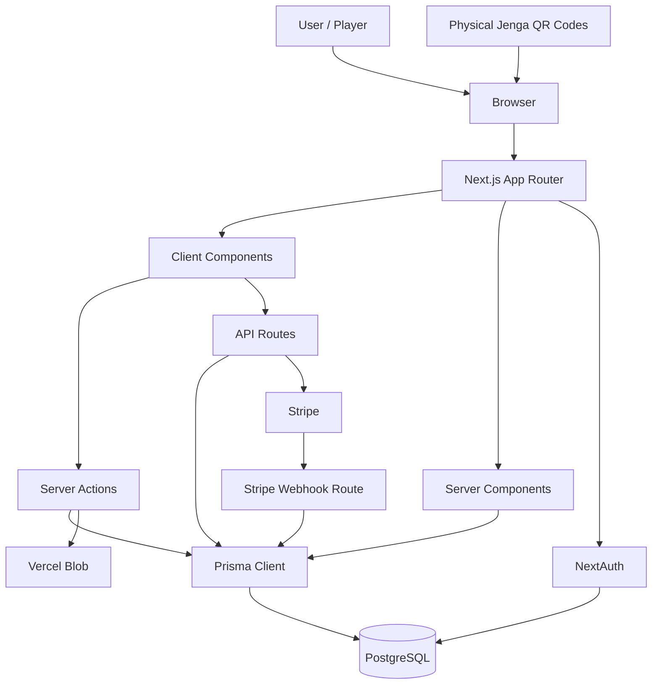
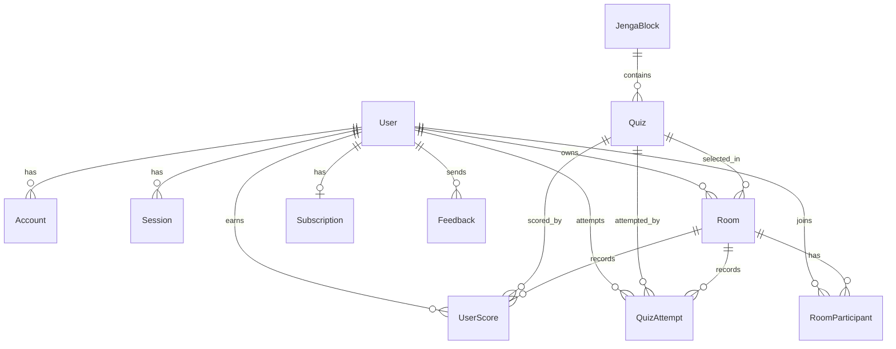
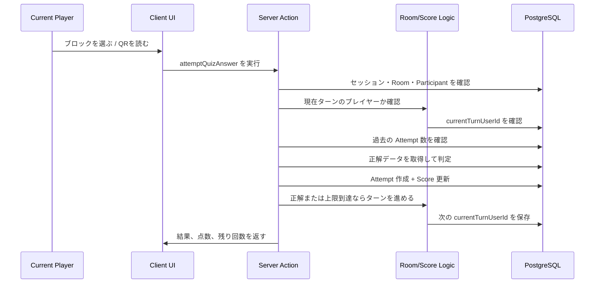

# Jenga Architect レポート

## 1. プロダクト概要

Jenga Architect は、物理的な Jenga ブロック、QR コード、OOP クイズ、ソロ練習、マルチプレイ対戦を組み合わせた、Python のオブジェクト指向プログラミング学習アプリです。

学習者はブロックを選ぶ、または QR コードを読み取り、表示された OOP クイズに答えます。正解・不正解、残り挑戦回数、得点、ターン制、脱落などを通して、ただ読むだけではなく「遊びながら理解する」体験を作っています。

## 2. このプロダクトでできること

- Entry、Junior、Senior のレベル別ソロクイズ学習
- ホスト作成型のマルチプレイルーム
- 8桁の Join Code によるルーム参加
- ターン制のクイズ回答
- 正解時の加点、不正解時の減点、最大挑戦回数の管理
- Jenga タワーを崩したプレイヤーの脱落処理
- プレイヤー別スコア・順位表示
- QR コードと物理ブロックの連携
- Google / GitHub ログイン
- Pro プランによるプレミアムレベル制御
- Stripe サブスクリプション連携
- プロフィール画像アップロード
- フィードバック投稿と管理者向け確認画面

## 3. ターゲットユーザー

主なターゲットは、Python の基礎文法を学んだ後に OOP を学び始める beginner から intermediate レベルの学習者です。

特に以下のユーザーに向いています。

- class、object、method、inheritance などが抽象的で理解しづらい人
- Python の文法は知っているが、設計としての OOP が苦手な人
- 一人で問題集を解くより、ゲーム形式の方が継続しやすい人
- 友達やクラスメイトと一緒に学びたい人
- 教室やワークショップで使える参加型教材を探している先生

## 4. なぜ開発したのか

OOP は初心者にとって抽象度が高く、単に説明を読むだけでは理解が定着しにくい分野です。特に「クラスは何のためにあるのか」「オブジェクト同士の関係をどう考えるのか」は、実際に何度も考えて使わないと身につきません。

そこで、Jenga の物理的な緊張感とクイズ学習を組み合わせることで、OOP 学習を記憶に残りやすい体験にしたいと考えました。ブロックを抜く、問題を解く、点数が変わる、友達と競う、という流れにすることで、学習を「勉強」ではなく「挑戦」に変えることを目指しました。

## 5. なぜターゲットユーザーに合っているのか

Jenga Architect は、OOP 初学者がつまずきやすい「抽象的で退屈に感じる」という問題を、ゲーム性で下げています。

- 短いクイズなので始めやすい
- レベル制で段階的に難易度を上げられる
- マルチプレイで説明し合いながら学べる
- QR コードと物理ブロックにより、学習が体験として残りやすい
- 即時フィードバックで自分の理解度を確認できる
- 点数・ターン・脱落により集中力が続きやすい

## 6. 解決できる問題

- OOP が抽象的で理解しづらい
- 通常のクイズや教材では学習モチベーションが続かない
- 教室で全員が参加できるプログラミング活動を作りにくい
- 学習者がどのレベルでつまずいているか分かりにくい
- グループ学習で順番、スコア、進行管理が面倒
- 物理教材とデジタル教材が分断されやすい

## 7. アーキテクチャ図



### アーキテクチャの説明

画面表示は Next.js App Router で構成しています。ユーザー操作が必要な部分は Client Component、認証や DB 取得が必要な部分は Server Component、データ更新は Server Actions または API Routes に分けています。

Prisma を通して PostgreSQL にアクセスし、認証は NextAuth、決済は Stripe、画像保存は Vercel Blob を使っています。物理 Jenga ブロックは QR コードを通してアプリ内のクイズ画面に接続されます。

## 8. DB 設計・ERD



### 主要テーブルの役割

| モデル | 役割 |
| --- | --- |
| `User` | ユーザー情報、権限、Pro 状態を管理 |
| `JengaBlock` | 物理 Jenga ブロックとカテゴリを管理 |
| `Quiz` | 問題文、選択肢、正解、レベル、Premium 判定を管理 |
| `Room` | マルチプレイルーム、Join Code、状態、現在ターンを管理 |
| `RoomParticipant` | ルーム参加者、合計点、脱落状態を管理 |
| `QuizAttempt` | 何回目の回答か、正解か、点数変動を記録 |
| `UserScore` | ユーザーごとのスコア履歴を記録 |
| `Subscription` | Stripe の購読状態を管理 |
| `Feedback` | ユーザーからの改善要望やバグ報告を管理 |

### Room / Participant / Attempt / Score の関係

`Room` は対戦そのもの、`RoomParticipant` はその部屋に参加しているプレイヤー、`QuizAttempt` は各プレイヤーの回答履歴、`UserScore` はスコア履歴を表します。

マルチプレイでは、単に「ユーザーがクイズに答えた」だけではなく、「どの Room で、どの Player が、どの Quiz に、何回目で答え、点数がどう変わったか」を保存する必要があります。そのため、`RoomParticipant` と `QuizAttempt` を分けて設計しています。

## 9. 主要フロー図：マルチプレイの1ターン



### フローのポイント

1ターンの中で最も重要なのは、クライアントを信用しないことです。ブラウザ側で「自分のターンです」と送られてきても、その情報は使わず、サーバー側で Room、Participant、currentTurnUserId、過去 Attempt を確認してから点数を更新しています。

## 10. API / Server Actions 一覧

### Server Actions

| ファイル | 関数 | 役割 |
| --- | --- | --- |
| `src/actions/quiz.ts` | `verifyQuizAnswer` | ソロクイズなどで回答を検証 |
| `src/actions/score.ts` | `attemptQuizAnswer` | マルチプレイの回答、点数、Attempt、ターン更新 |
| `src/actions/score.ts` | `breakTower` | Jenga タワーを崩したプレイヤーを脱落扱いにする |
| `src/actions/upload.ts` | `uploadToCloud` | プロフィール画像を Vercel Blob にアップロード |
| `src/actions/profile.ts` | `updateUsername`, `updatePhoto`, `deleteUserAccount` | ユーザー設定の更新・削除 |
| `src/actions/feedback.ts` | `createNewFeedback` | フィードバック投稿 |
| `src/actions/feedback.ts` | `feedbackReadUpdate` | 管理者がフィードバックを既読にする |

### API Routes

| API Route | Method | 役割 |
| --- | --- | --- |
| `/api/rooms/create` | `POST` | 新しいマルチプレイルームを作成 |
| `/api/rooms/join` | `POST` | Join Code でルームに参加 |
| `/api/rooms/[roomCode]` | `GET` | ルーム情報を取得 |
| `/api/rooms/[roomCode]/start` | `PATCH` | ルームを開始し、最初のターンを設定 |
| `/api/rooms/[roomCode]/leave` | `POST` | ルームから退出 |
| `/api/rooms/[roomCode]/close` | `DELETE` | ルームを閉じる |
| `/api/rooms/[roomCode]/break-tower` | `POST` | タワー崩壊イベントを記録 |
| `/api/quizzes` | `GET` | クイズ一覧を取得 |
| `/api/stripe/subscription` | `POST` | Stripe Checkout / サブスクリプション処理 |
| `/api/stripe/cancel-subscription` | `POST` | サブスクリプションをキャンセル |
| `/api/stripe/webhook` | `POST` | Stripe Webhook を受け取り DB と同期 |
| `/api/auth/[...nextauth]` | NextAuth | OAuth 認証処理 |

### Client と Server の分担

| 領域 | 担当 |
| --- | --- |
| Client Component | ボタン操作、選択肢表示、ローディング、画面遷移 |
| Server Component | 初期データ取得、認証済みユーザー確認 |
| Server Actions | フォーム送信、回答検証、スコア更新、画像アップロード |
| API Routes | ルーム操作、Stripe、外部サービス連携 |
| Prisma / DB | 永続化、関係データの取得、整合性管理 |

## 11. 自分が実装した範囲

このプロジェクトで自分が実装した範囲として説明できる内容は以下です。

- Next.js App Router を使った画面・ルーティング構成
- ソロプレイとマルチプレイの基本画面
- Room 作成、Join Code 参加、Room 開始、退出、終了の流れ
- `RoomParticipant` による参加者管理
- `currentTurnUserId` によるターン管理
- `QuizAttempt` による回答回数と正誤履歴の保存
- `src/actions/score.ts` のマルチプレイ回答・採点・スコア更新処理
- `src/lib/room-turn.ts` のターン進行ロジック
- `src/lib/multiplayer-scoring.ts` の点数・順位計算ロジック
- NextAuth による Google / GitHub 認証
- 管理者ページの Middleware 保護
- Prisma schema による DB 関係設計
- QR コード生成と物理ブロック連携
- Stripe subscription 関連ルート
- プロフィール画像アップロードと validation
- README と Report のドキュメント整備

## 12. 技術選定理由

| 技術 | 選定理由 |
| --- | --- |
| Next.js | 画面、API Routes、Server Actions、認証連携を1つのアプリで扱えるため |
| React | クイズ、スコア、ルーム状態などのインタラクティブ UI を作りやすいため |
| TypeScript | Room、Quiz、User などの型を明確にし、実装ミスを減らせるため |
| Prisma | DB のリレーションを型安全に扱え、ERD に近い形で設計を表現できるため |
| PostgreSQL | Room、Participant、Attempt など関係性の強いデータに向いているため |
| NextAuth | Google / GitHub OAuth と Prisma Adapter を比較的安全に統合できるため |
| Stripe | Pro レベルなどのサブスクリプション課金を実装しやすいため |
| Vercel Blob | プロフィール画像などのファイル保存を Vercel 環境と相性よく扱えるため |
| React Three Fiber / Three.js | Jenga タワーの視覚表現を Web 上で作るため |

## 13. セキュリティ面で工夫したコード

### NextAuth の JWT 更新

`src/lib/auth.ts` では、`role` や `isPro` をクライアントからの session update に任せず、毎回 DB から再取得しています。これにより、ユーザーがブラウザ側の値を書き換えても Admin や Pro に昇格できないようにしています。

### 管理者ページの保護

`src/middleware.ts` では、`/feedback` と `/usersCheck` を管理者専用ページとして保護しています。未ログインならサインインへ、Admin でなければトップページへリダイレクトします。

### サーバー側でのクイズ判定

`src/lib/quiz.ts` では、正解データをサーバー側で取得して判定しています。クライアントに正解を含めないことで、ブラウザ検証ツールから答えを見られるリスクを下げています。

### マルチプレイのターン検証

`src/actions/score.ts` では、ログイン、Room 状態、参加者かどうか、脱落していないか、自分のターンか、最大 Attempt を超えていないかを確認してからスコアを更新しています。

### DB Transaction

回答履歴の作成とスコア更新は Prisma transaction でまとめています。片方だけ成功してデータが不整合になるリスクを下げています。

### Upload Validation

`src/actions/upload.ts` と `src/lib/validation.ts` で、画像の MIME type と最大サイズをチェックしています。想定外のファイルアップロードを防ぐための基本対策です。

## 14. 一番苦労した部分

一番苦労したのはマルチプレイの状態管理です。

通常のクイズアプリであれば「ユーザーが問題に答える」だけで済みます。しかし、このアプリでは以下の状態を同時に管理する必要がありました。

- Room が Waiting / Playing / Finished のどれか
- 誰が Room owner か
- 誰が参加者か
- 現在のターンは誰か
- そのプレイヤーは脱落していないか
- その Quiz に何回挑戦したか
- 正解・不正解で何点変わるか
- 正解または回数上限で次のターンに進めるか

特に難しかったのは、UI 側の状態ではなく、DB にある状態を正として扱うことです。マルチプレイでは複数ユーザーが同時に操作するため、クライアントの表示だけを信用すると不正な回答やターンずれが起きます。

## 15. どう修正・解決したか

解決策として、責務を分けました。

| ファイル | 責務 |
| --- | --- |
| `src/lib/room-turn.ts` | ターン順、現在ターン、次ターンの決定 |
| `src/lib/multiplayer-scoring.ts` | 点数、ペナルティ、順位計算 |
| `src/actions/score.ts` | 認証、Room 検証、Attempt 作成、Score 更新 |
| `prisma/schema.prisma` | Room / Participant / Attempt / Score の関係定義 |

この分割により、UI コンポーネントにゲームルールを詰め込まず、サーバー側で安全にルールを管理できるようにしました。

## 16. 失敗・詰まったバグ

### バグ1: ターン制で別プレイヤーが回答できる可能性

最初は UI 側で「今のプレイヤー」を表示していましたが、それだけではリクエストを直接送れば別プレイヤーが回答できる可能性があります。

修正として、`isPlayerTurn(room.id, session.user.id)` をサーバー側で呼び、DB の `currentTurnUserId` とログイン中ユーザーを照合してから回答処理を進めるようにしました。

### バグ2: Attempt と Score の不整合

回答履歴だけ作成されてスコア更新に失敗する、またはその逆が起きるとランキングが壊れます。

修正として、`prisma.$transaction` を使い、Attempt 作成と Score 更新を一つの処理として扱いました。

### バグ3: Premium レベルへの不正アクセス

UI でボタンを disabled にしても、API に直接リクエストされる可能性があります。

修正として、`/api/rooms/create` 側で `parseLevel` と `canAccessLevel` を実行し、サーバー側でも Pro / Admin 判定を行うようにしました。

## 17. テスト方針

現状は今後追加の余地がありますが、追加するなら以下の順番でテストを書くのが効果的です。

| 優先度 | テスト対象 | テスト内容 |
| --- | --- | --- |
| 高 | `src/lib/multiplayer-scoring.ts` | 正解点、減点、順位、脱落者表示が正しいか |
| 高 | `src/lib/room-turn.ts` | 脱落者を飛ばして次ターンに進むか |
| 高 | `src/lib/quiz.ts` | 正しい選択順だけを正解にするか |
| 高 | `src/actions/score.ts` | 未ログイン、非参加者、脱落者、別ターンの回答を拒否するか |
| 中 | `/api/rooms/create` | Premium レベルを非 Pro ユーザーが作れないか |
| 中 | `/api/rooms/join` | 存在しない Room や満員 Room を拒否できるか |
| 中 | `src/actions/upload.ts` | 不正 MIME type とサイズ超過を拒否できるか |
| 低 | UI コンポーネント | ボタン disabled、loading、error 表示が正しいか |

### 使うテスト

- Unit Test: scoring、turn、quiz など純粋ロジック
- Integration Test: Server Actions と Prisma の連携
- E2E Test: Room 作成、Join、Start、Answer、Turn advance の一連フロー
- Security Test: 権限なしユーザーが Admin / Premium / 他人の Turn にアクセスできないこと

## 18. デプロイ・環境構成

```mermaid
flowchart LR
    GitHub[GitHub Repository] --> Vercel[Vercel Deployment]
    Vercel --> App[Next.js App]
    App --> DB[(PostgreSQL)]
    App --> OAuth[Google / GitHub OAuth]
    App --> Stripe[Stripe API]
    Stripe --> Webhook[/api/stripe/webhook]
    App --> Blob[Vercel Blob]
```

### 必要な環境変数

| 種類 | 例 |
| --- | --- |
| Database | `DATABASE_URL` |
| NextAuth | `NEXTAUTH_SECRET`, `NEXTAUTH_URL` |
| Google OAuth | `GOOGLE_CLIENT_ID`, `GOOGLE_CLIENT_SECRET` |
| GitHub OAuth | `GITHUB_ID`, `GITHUB_SECRET` |
| Stripe | `STRIPE_SECRET_KEY`, `STRIPE_WEBHOOK_SECRET`, `NEXT_PUBLIC_STRIPE_PUBLISHABLE_KEY` |
| Vercel Blob | `BLOB_READ_WRITE_TOKEN` |

### デプロイ時に説明できるポイント

- Vercel に Next.js アプリをデプロイする
- PostgreSQL は外部 DB として接続する
- Prisma Client は build 時に generate する
- Stripe Webhook URL を `/api/stripe/webhook` に設定する
- OAuth callback URL を本番 URL に合わせる
- 秘密情報は `.env` ではなく Vercel の Environment Variables に登録する

## 19. さらに改善するなら

- リアルタイム更新を polling から WebSocket / Realtime service に変更する
- クイズ回答後に解説を表示する
- Teacher dashboard を作り、苦手分野や正答率を可視化する
- 問題タイプを増やす: コード読解、並び替え、短いコード入力
- E2E テストを追加して、マルチプレイ全体の品質を上げる
- Rate limit を追加して API 連打を防ぐ
- QR コード読み取り後の UX を改善する
- アクセシビリティを改善する

## 20. 改善優先順位

| 優先度 | 改善内容 | 理由 |
| --- | --- | --- |
| 1 | マルチプレイの E2E テスト追加 | 一番壊れると困る中心機能だから |
| 2 | 回答後の解説表示 | 学習効果に直接つながるから |
| 3 | Realtime 化 | マルチプレイ体験をより自然にできるから |
| 4 | Teacher dashboard | 教室利用の価値を高められるから |
| 5 | Rate limit / Anti-cheat 強化 | 公開運用時の安全性を上げるため |
| 6 | 問題タイプ拡張 | OOP 理解をより深く測れるようにするため |

## 21. 自信があるコード・アピールポイント

一番アピールしたいのは、マルチプレイのゲームルールを UI ではなくサーバー側に置いた点です。

`src/actions/score.ts` は、単に答えを受け取るだけではありません。ログイン確認、Room 状態、参加者確認、脱落確認、ターン確認、過去 Attempt 確認、正誤判定、点数計算、DB transaction、ターン進行まで担当しています。

`src/lib/room-turn.ts` は、脱落者を除外しながら次のプレイヤーを決めます。ゲームの進行に関わる重要なロジックを UI から切り離しているため、読みやすく、修正しやすい構造になっています。

`src/lib/multiplayer-scoring.ts` は、点数や順位計算を独立させています。ゲームバランスを変えたい場合も、このファイルを中心に調整できます。

## 22. トレードオフ

| 選択 | メリット | デメリット |
| --- | --- | --- |
| Polling | 実装が簡単で安定しやすい | 完全リアルタイムではなくリクエスト数が増える |
| Server-side answer check | 正解を隠しやすく安全 | 回答ごとにサーバー通信が必要 |
| QR + 物理ブロック | 体験として印象に残る | QR 印刷やブロック準備が必要 |
| Stripe subscription | Pro 機能を収益化できる | 決済・Webhook・環境変数が複雑になる |
| Prisma + PostgreSQL | 関係データを扱いやすい | schema 設計と migration 管理が必要 |
| Turn-based multiplayer | ゲーム性が高い | 状態管理と不正操作対策が難しい |

## 23. KPI

| KPI | 目的 |
| --- | --- |
| Weekly Active Learners | 継続利用されているかを見る |
| Solo Quiz Completion Rate | 一人学習が最後まで使われているかを見る |
| Multiplayer Room Creation Count | グループ利用の需要を見る |
| Average Players Per Room | マルチプレイが実際に複数人で使われているかを見る |
| Correct Answer Rate By Level | Entry / Junior / Senior の難易度が適切かを見る |
| Repeat Attempt Rate | どの問題でつまずいているかを見る |
| Pro Conversion Rate | 有料機能に価値があるかを見る |
| Feedback Submission Count | ユーザーが改善要望を出してくれているかを見る |
| Return Rate After First Game | 初回体験後に戻ってくる魅力があるかを見る |

## 24. STAR テーブル

| STAR | 内容 |
| --- | --- |
| Situation | Python の OOP 学習は抽象的で、初心者が class や object の関係を理解しづらい。また、通常の問題集ではモチベーションが続きにくい。 |
| Task | OOP 学習を、物理的で楽しく、友達と一緒に学べる体験に変える Web アプリを作る必要があった。 |
| Action | Next.js、Prisma、PostgreSQL、NextAuth、Stripe を使い、ソロクイズ、マルチプレイルーム、ターン制、スコア、QR ブロック、認証、サブスクリプションを実装した。 |
| Result | 学習者が Jenga を使いながら OOP クイズに挑戦できる、ゲーム性のある学習プロダクトになった。特にマルチプレイでは、サーバー側でターン・スコア・Attempt を管理することで、安全に対戦できる構造を作れた。 |

## 25. 最後に伝えたいアピール

Jenga Architect は、単なるクイズアプリではありません。物理的な Jenga、QR コード、OOP 学習、マルチプレイ、認証、課金、DB 設計を組み合わせた学習体験です。

特にアピールしたい点は、ゲームとして楽しいだけでなく、サーバー側でルールを守る設計にしていることです。初心者向けのプロダクトでありながら、Room、Participant、Attempt、Score という実アプリに近いデータ設計を持っているため、学習教材としても Web アプリ開発の作品としても説明しやすいプロダクトになっています。
